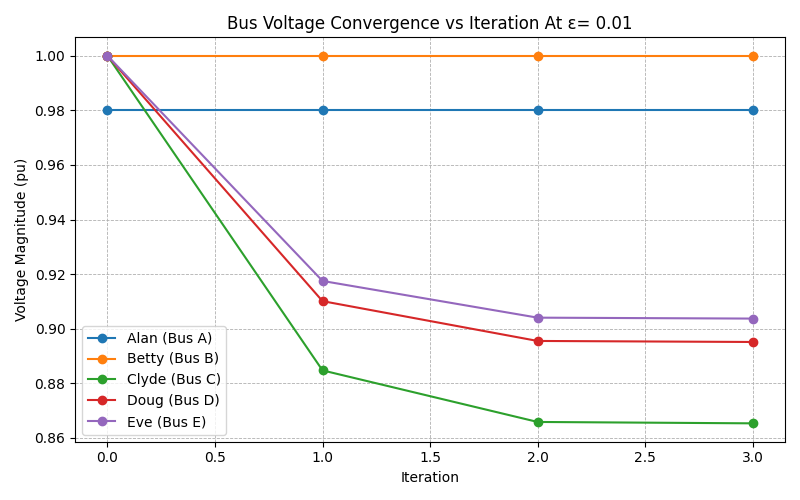
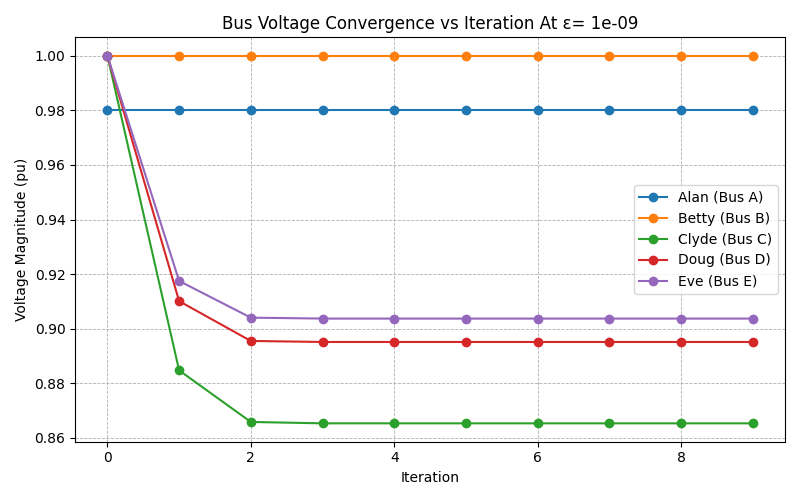
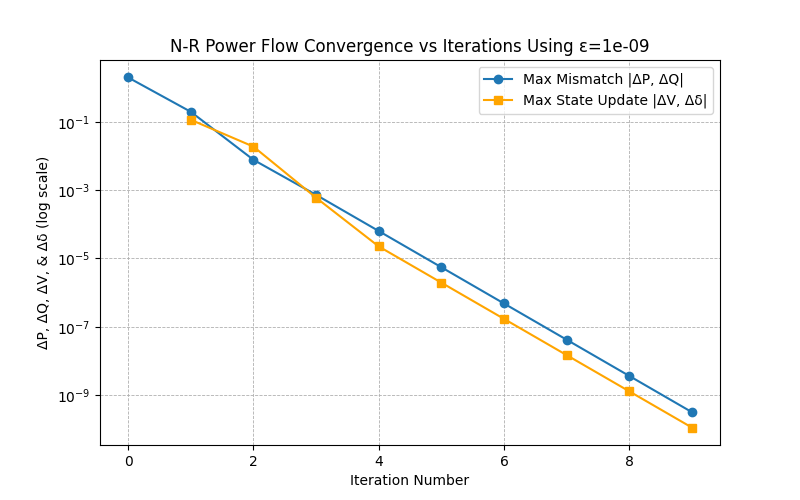
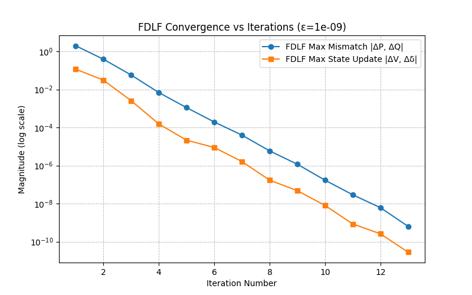
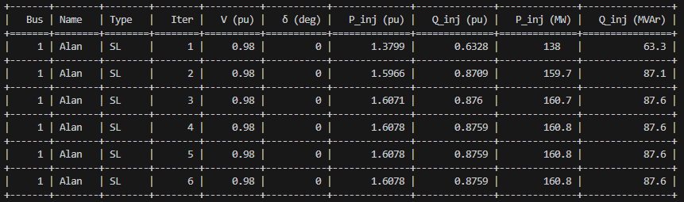
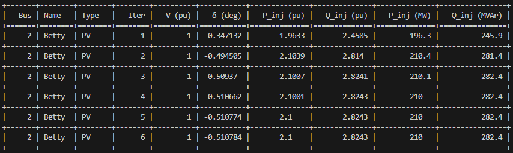
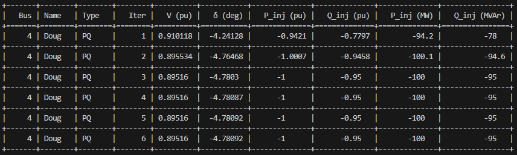
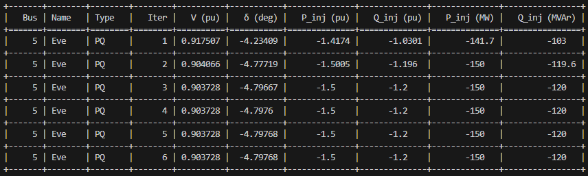

# Newton–Raphson & Fast-Decoupled Load Flow (NR/FDLF) Solver

### Description

This project implements a small power-flow solver for an _n_-bus system using:

- **Full Newton–Raphson (NR)** power flow
- **Fast-Decoupled Load Flow (FDLF)** (B' / B'' method)

It is currently set up to read a `FiveBus_PQ`-style text file and solve that network for multiple mismatch tolerances.

#### Created: 11/10/2025

#### Modified: 12/03/2025

#### Author: Jeff Dinsmore

#### Licence: GPL-3.0 license

---

## Installation

#### The Following commands will be used in the terminal using PowerShell or Bash:

- Clone this repository
- Open repository in your preferred code builder program. (This was built in VS Code)
- cd into the _Fall2025HW_ folder
- Check python version
  - _python --version_
- If no python, download using winget
  - _winget install Python.Python.3.12_
- Install virtual venv environment
  - _python -m venv .venv_
- Activate .venv environment
  - _source .venv/Scripts/activate_
- Upgrade pip version
  - _python -m pip install --upgrade pip_
- Download packages that are used in this script
  - _pip install —upgrade pandas numpy tabulate math cmath matplotlib pprint_

---

## Features

- Parses a simple text-based system description (`SYSTEM`, `BUS`, `LINE` records)
- Builds the complex **Y-bus** matrix from per-unit line impedances
- Builds reduced **B'** (for angles) and **B''** (for voltage magnitudes) for FDLF
- Supports **SLACK**, **PQ**, and **PV** bus types
- Runs NR and FDLF for a list of mismatch tolerances `EPS = [1e-2, 1e-4, 1e-6]`
- Tracks:
  - Mismatch norms and state updates per iteration
  - Per-bus voltage magnitude, angle, P/Q injections by iteration
- Writes results to CSV and plots convergence on a log scale

---

## File Overview

Main script (your Python file) contains:

- Global config:
  - `EPS` – list of mismatch tolerances
  - `MAX_ITERS` – maximum number of iterations for NR and FDLF
  - Bus type constants: `SLACK`, `PQ`, `PV`
- **Parsing / I/O**
  - `load_system_file(filename)` – reads base MVA and BUS records
  - `load_line_data(filename, bus_name_to_num)` – reads LINE records and builds line impedance dict `Z`
- **Network construction**
  - `build_Ybus(Z, n=None)` – builds complex Y-bus
  - `build_B_prime_and_B_double_prime(B_full, buses)` – builds B' and B'' for FDLF
  - `display_Ybus(Ybus)` – pretty-prints Y-bus (optional, for debugging)
- **Power flow core**
  - `PowerVariables` class
    - stores reduced P/Q spec and calc vectors
    - builds mismatch vector(s)
    - builds NR state vector
    - constructs all 4 Jacobian blocks `J1`–`J4`
    - assembles full Jacobian `J`
    - solves for `Δx` and applies state updates to bus data
  - `compute_bus_injections(buses, Ybus)` – computes full P/Q injections at each bus
  - `print_bus_info()` – prints final bus voltages / angles / injections and writes `final_bus_results.csv`
- **Solvers**
  - `run_iterations()` – Newton–Raphson solver
  - `run_fdlf()` – Fast-Decoupled Load Flow solver
- **Main**
  - Runs NR and FDLF, prints total timings and per-iteration averages

---

## Input File Format (`FiveBus_PQ`-style)

The code expects a text file with blocks like:

```text
% comment lines start with %
SYSTEM  FiveBus_PQ   100   0.05

BUS  Alan   SL  1.00   0.0   0.0   0.0   0.0   0.0
BUS  Betty  PQ  1.00   0.0   0.0   0.9   0.5   0.0
BUS  Clyde  PV  1.01   1.3   0.0   0.0   0.0   0.0
...

LINE  Alan   Betty  0.0  0.10  0.0  0.0  999
LINE  Alan   Clyde  0.0  0.25  0.0  0.0  999
LINE  Betty  Clyde  0.0  0.20  0.0  0.0  999
...
```

---

## Results

<p float="left">
  
  
</p>
<p float="left">
  
  
</p>

<p float="left">
  
  
</p>

<p float="left">
  
  
</p>

<p float="left">
  
  
</p>

---

### The Max Bus result of N-R and FDLF for each iteration using ε=1e-06

<p>
  ======================== Running NR with EPS = 1e-06 ========================<br>
  Iter 0: max mismatch = 1.9978433598183885, [Δv, Δδ] = 1<br>
  Iter 0: ΔV & Δδ not computed yet<br>
  Iter 1: max mismatch = 0.19749135582722577, [Δv, Δδ] = 0.11524655390253655<br>
  Iter 2: max mismatch = 0.007756691761843459, [Δv, Δδ] = 0.018885424228148255<br>
  Iter 3: max mismatch = 0.0007295450521884739, [Δv, Δδ] = 0.0006021531095129415<br>
  Iter 4: max mismatch = 6.367679013674632e-05, [Δv, Δδ] = 2.254682865366751e-05<br>
  Iter 5: max mismatch = 5.535414396629079e-06, [Δv, Δδ] = 1.9599402516178526e-06<br>
  Iter 6: max mismatch = 4.811913369984211e-07, [Δv, Δδ] = 1.7037644364632053e-07<br>
  N-R Converged in 6 iterations with ε=1e-06<br>
</p>

<p>
  ======================== Running FDLF with EPS = 1e-06 ========================<br>
  Iter 0: max mismatch = 1.997843e+00, max [Δv, Δδ] = 1.170425e-01<br>
  Iter 1: max mismatch = 3.914411e-01, max [Δv, Δδ] = 3.115791e-02<br>
  Iter 2: max mismatch = 5.827013e-02, max [Δv, Δδ] = 2.601853e-03<br>
  Iter 3: max mismatch = 6.919409e-03, max [Δv, Δδ] = 1.548606e-04<br>
  Iter 4: max mismatch = 1.117655e-03, max [Δv, Δδ] = 2.169311e-05<br>
  Iter 5: max mismatch = 1.969816e-04, max [Δv, Δδ] = 8.960917e-06<br>
  Iter 6: max mismatch = 4.002192e-05, max [Δv, Δδ] = 1.630399e-06<br>
  Iter 7: max mismatch = 5.929995e-06, max [Δv, Δδ] = 1.713213e-07<br>
  Iter 8: max mismatch = 1.178264e-06, max [Δv, Δδ] = 4.810994e-08<br>
  Iter 9: max mismatch = 1.705961e-07, max [Δv, Δδ] = 7.985301e-09<br>
  FDLF Converged in 10 iterations with ε=1e-06<br>
</p>

---

### Table of N-R results of each bus after each iteration using ε=1e-06

#### Table 1: Alan Slack bus results

<p float="left">
  <br>
</p>

#### Table 2: Betty PV bus results

<p float="left">
  <br>
</p>

#### Table 2: Clyde PQ bus results

<p float="left">
  <br>
</p>

#### Table 4: Doug PQ bus results

<p float="left">
  <br>
</p>

#### Table 5: Eve PQ bus results

<p float="left">
  <br>
</p>

---

### Time to process the convergence functions for N-R and FDLF

#### For 3 N-R iterations and 4 FDLF iterations at ε=1e-02

- N-R iterations time: **0.382310 seconds** taking **0.127437 seconds** per iteration
- FDLF iteration time: **0.394830 seconds** taking **0.098708 seconds** per iteration

#### For 9 N-R iterations and 12 FDLF iterations at ε=1e-09

- N-R iterations time: **0.144251** seconds taking **0.016028 seconds** per iteration
- FDLF iteration time: **0.175566** seconds taking **0.013505 seconds** per iteration

### Total time to process four ε values, EPS = [1e-2, 1e-4, 1e-6, 1e-9]

- N-R total iterations time: 1.159153 seconds
- FDLF total iterations time: 1.179878 seconds

---
